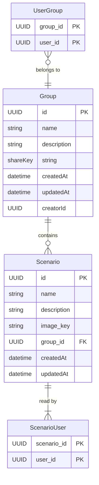

# SS仕様書

## システム方式

### バックエンド

Supabaseを利用。
無料枠利用はPostgres 500MB
ストレージ50MB

### フロントエンド

Next.js + Typescriptを利用。
UIのフレームワークとしてMUI v5を利用。
React Testing Frameworkでテストを行う。

### データベース

```mermaid
erDiagram
    UserGroup }o--|| Group : "belongs to"
    Group ||--o{ Scenario : "contains"
    Scenario ||--|{ ScenarioUser : "read by"

    
    Group {
        UUID id PK
        string name
        string description
        shareKey string
        datetime createdAt
        datetime updatedAt
        UUID creatorId
    }
    Scenario {
        UUID id PK
        string name
        string description
        string image_key
        UUID group_id FK
        datetime createdAt
        datetime updatedAt
    }
    UserGroup {
        UUID group_id PK
        UUID user_id  PK
    }
    ScenarioUser {
        UUID scenario_id PK
        UUID user_id PK
    }
```
